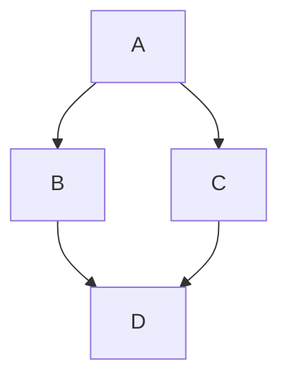

$$
\begin{aligned}
  \nabla \cdot \mathbf{E} &= \frac{\rho}{\varepsilon_0} \\
  \nabla \cdot \mathbf{B} &= 0 \\
  \nabla \times \mathbf{E} &= -\frac{\partial \mathbf{B}}{\partial t} \\
  \nabla \times \mathbf{B} &= \mu_0 \left( \mathbf{J} + \varepsilon_0 \frac{\partial \mathbf{E}}{\partial t} \right)
\end{aligned}
$$
